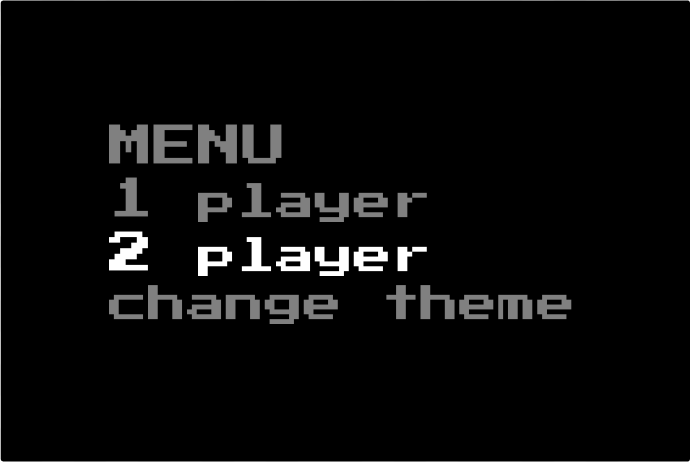
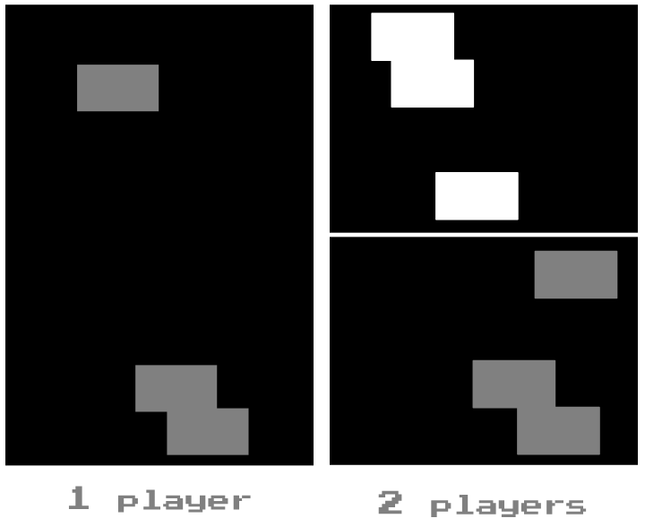
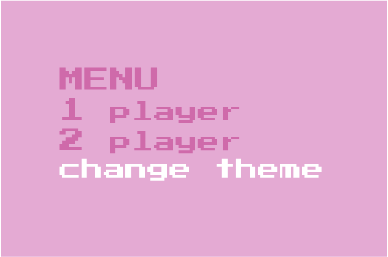
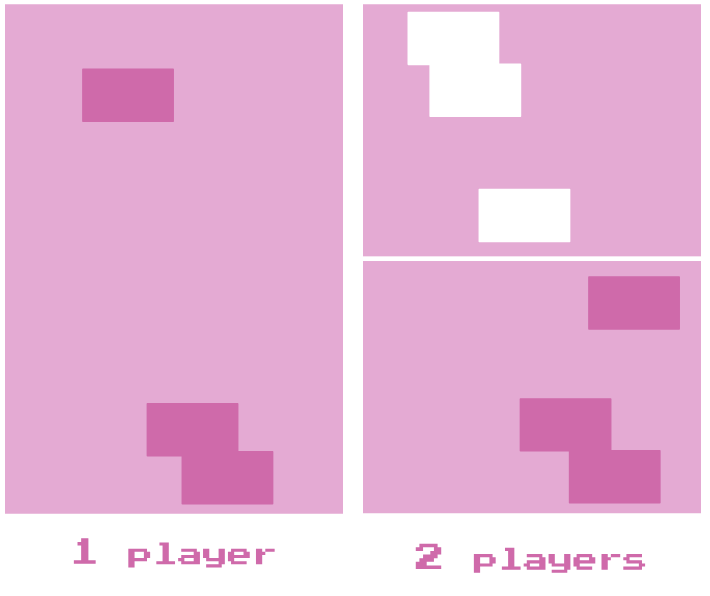

# Stacking Blocks
A self-explanatory name for the game where you stack falling blocks.

## Description
<table><tr>
  <td></td>
  <td></td>
</tr></table>
The <u>goal</u> of this game is to stack the blocks on top of each other so that the borderline of the latest block will not surpass the center of the previous one. 
 

<b>USER MANUAL</b>

- <u>Rotate</u> the <b>GREEN</b> KNOB to switch between options in the MENU.
- <u>Press</u> the <b>GREEN</b> KNOB to choose an option.
 
<b>1 player</b>:
- Rotate the <b>GREEN</b> KNOB to move the falling knob.
- Press the <b>GREEN</b> KNOB to make the block fall faster.
 <b>2 players</b>:
- Rotate the <b>RED</b> and <b>BLUE</b> KNOBS (respectively, for each player) to move the falling block.
- Press the <b>RED</b> and <b>BLUE</b> KNOBS (respectively, for each player) to make the block fall faster.

<b>THEME CHANGE:</b>

Switch between <b>BLACK</b> and <b>PINK</b> themes.
<table><tr>
  <td>
  </td>
  <td></td>
</tr></table>

<b>SPECIAL EFFECTS</b>

<b>In 1-player mode:</b>

- If a player wins,  RGB LEDs will light up with a green color, the LED line will light up and, according to the Morse code, show the word “WIN.”
- If a player loses,  RGB LEDs will light up with a red color, and the LED line will light up and, according to the Morse code, show the word “LOST.”

<b>In 2-player mode: </b>

- In a win-lose situation, the RGB LED on the winner’s side will light up green, and the other will be red.
- In case of a draw (either both lose or both win), RGB LEDs will light up with a blue color. 
